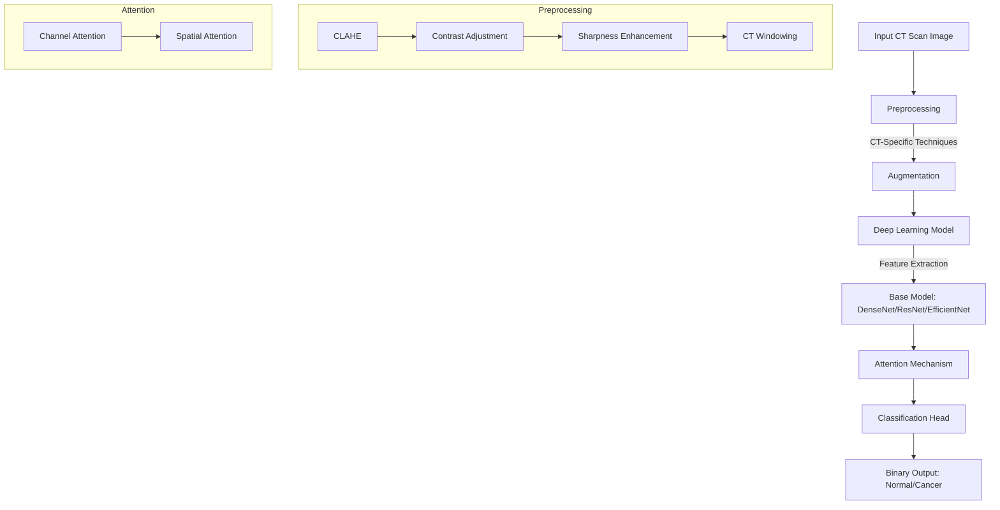
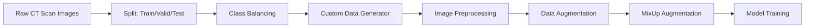
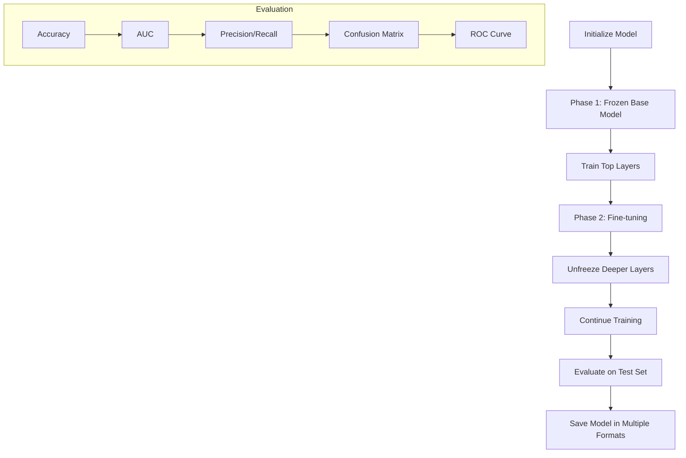
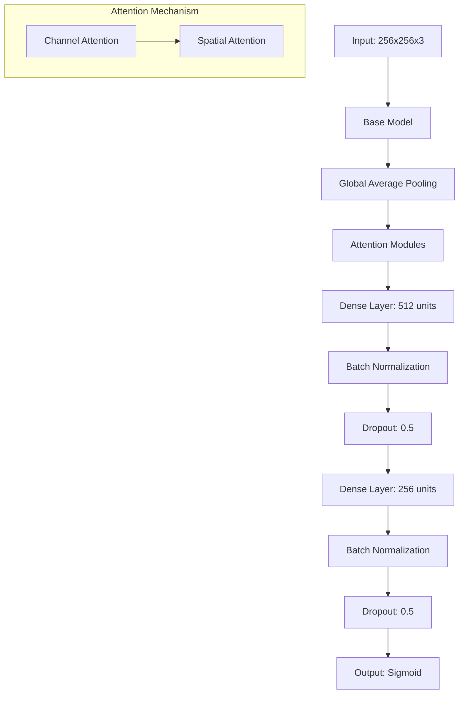
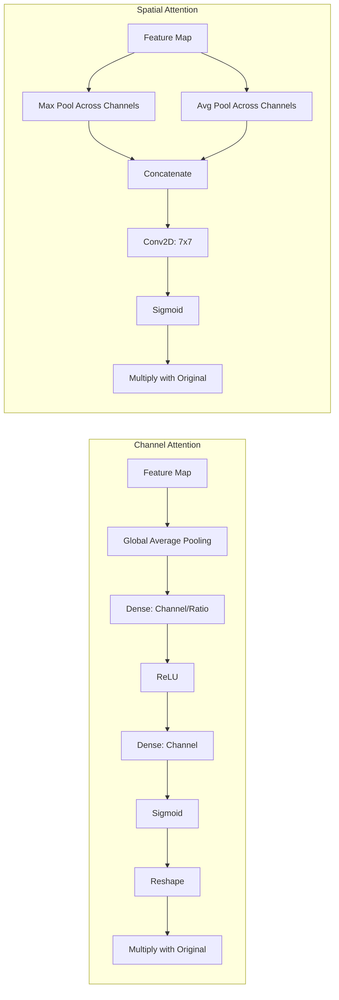
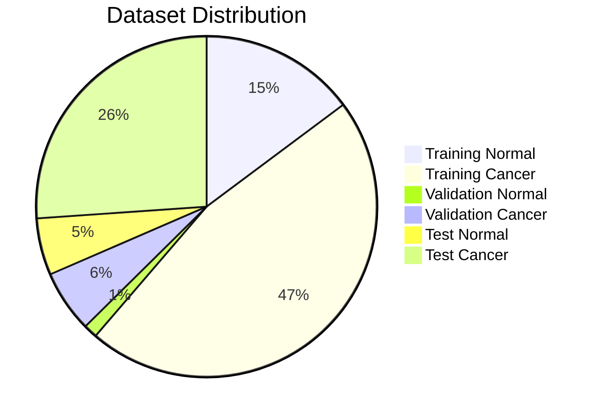
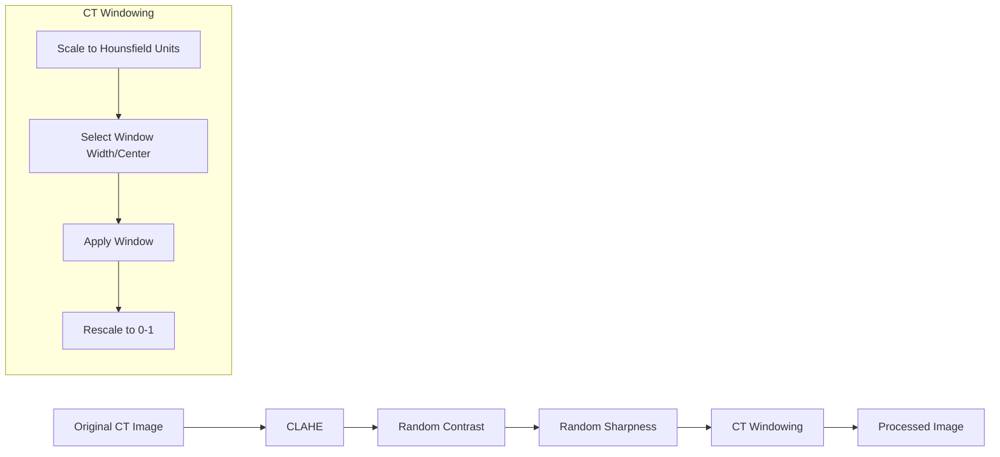
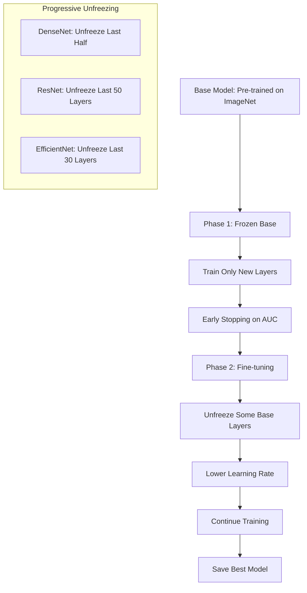
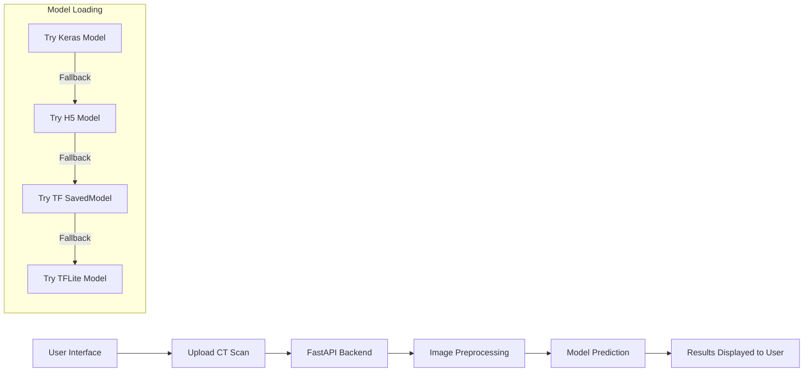
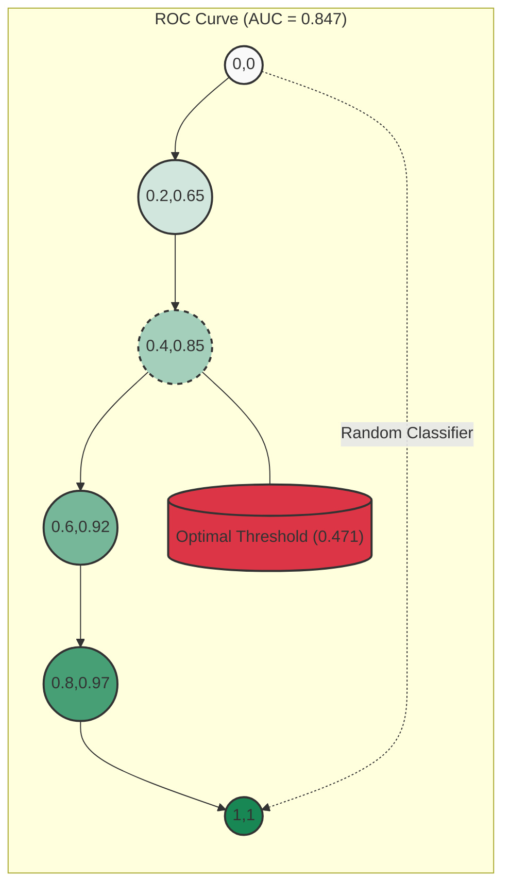

# Chest Cancer Detection

A deep learning project for detecting cancer in chest CT scan images using a binary classification approach based on DenseNet121 architecture with attention mechanisms.

## Overview

This project implements a convolutional neural network to classify chest CT scan images as either "Normal" or "Cancer". It uses transfer learning with DenseNet121 as the base model and includes custom preprocessing techniques specific to medical imaging, along with attention mechanisms to improve focus on relevant image regions.

## System Architecture



## Data Processing Pipeline



## Training Workflow



## Model Architecture



## Attention Mechanism Details



## Dataset

The project uses the Chest CT-Scan Images dataset available on Kaggle: [Chest CT-Scan Images Dataset](https://www.kaggle.com/datasets/mohamedhanyyy/chest-ctscan-images/data)

The dataset contains chest CT scan images organized in the following structure:
- Training set: Contains 613 images (148 normal scans and 465 cancer scans)
- Validation set: Contains 72 images (13 normal scans and 59 cancer scans)
- Test set: Contains 315 images (54 normal scans and 261 cancer scans)

Cancer scans include different types of lung cancer such as squamous cell carcinoma, adenocarcinoma, and large cell carcinoma.



## CT-Specific Preprocessing



## Two-Phase Training Strategy



## Kaggle Notebook

A complete implementation of this project is available as a Kaggle notebook:
- **Notebook**: [CT DenseNet Chest Cancer Detector](https://www.kaggle.com/code/ismetsemedov/ct-densenet-chest-cancer-detector)
- **Features**: The notebook includes all code for data exploration, model building, training, and evaluation with interactive visualizations
- **Environment**: Runs in Kaggle's GPU-accelerated environment for faster training
- **Reproducibility**: Contains all necessary code to reproduce the results

You can:
- View the notebook on Kaggle
- Fork it to run your own experiments
- Download it to run locally

## Demo Application Architecture



## Performance Metrics

The model achieves the following performance on the test set:

- **AUC Score**: 0.847 (95% CI: 0.785-0.903)
- **Sensitivity (Recall)**: 0.980
- **Specificity**: 0.185
- **Precision (PPV)**: 0.848
- **F1 Score**: 0.909
- **Optimal Threshold**: 0.471
- **Diagnostic Odds Ratio**: 11.136



## Features

- **Binary Classification**: Detects the presence of cancer (regardless of type) in chest CT scans
- **Attention Mechanisms**: Implements channel and spatial attention to help the model focus on relevant features
- **Medical-specific Image Preprocessing**: Implements techniques like CLAHE, contrast adjustment, sharpness enhancement, and CT windowing optimized for CT scans
- **Balanced Training**: Uses a custom data generator that ensures balanced class representation during training
- **MixUp Augmentation**: Applies MixUp technique to improve model generalization
- **Two-phase Training**: Initial training with frozen base model followed by fine-tuning of deeper layers
- **Comprehensive Evaluation**: Includes accuracy, AUC, precision, recall, confusion matrix, and ROC curve analysis
- **Multiple Export Formats**: Saves the model in various formats (Keras, TensorFlow SavedModel, TFLite, H5)

## Project Structure

```
.
├── app.py                 # FastAPI application for serving the model
├── LICENSE                # MIT License
├── models                 # Directory containing trained models
│   ├── binary_model_densenet_checkpoint.keras
│   ├── chest_ct_binary_classifier_densenet_20250427_182239.h5
│   ├── chest_ct_binary_classifier_densenet_20250427_182239.keras
│   ├── chest_ct_binary_classifier_densenet_20250427_182239.tflite
│   └── chest_ct_binary_classifier_densenet_tf_20250427_182239
├── README.md              # Project documentation
├── requirements.txt       # Python dependencies
├── static                 # Static files for web interface
│   ├── index.html
│   ├── script.js
│   └── styles.css
└── trainer.py             # Main training script
```

## Technical Implementation

- **Architecture**: Modified DenseNet121 with custom dense layers and regularization
- **Attention Modules**: Channel attention and spatial attention to focus on relevant regions
- **Data Augmentation**: Extensive augmentation including rotation, shifts, zooming, flips, and MixUp
- **Regularization**: Implements dropout, batch normalization, and L2 regularization to prevent overfitting
- **Learning Rate Management**: Uses ReduceLROnPlateau to adaptively adjust learning rate
- **Early Stopping**: Implements early stopping to prevent overfitting during training
- **Custom Loss Function**: Implementation of Focal Loss for handling class imbalance
- **Optimal Threshold**: Automatically determines optimal classification threshold from ROC curve

## Requirements

- Python 3.8+
- TensorFlow 2.19.0
- NumPy 2.1.3
- Pandas 2.2.3
- Matplotlib 3.10.1
- scikit-learn 1.6.1
- Pillow 11.2.1
- FastAPI 0.115.12

See `requirements.txt` for a complete list of dependencies.

## Installation

1. Clone the repository:
```bash
git clone https://github.com/Ismat-Samadov/chest_cancer_detection.git
cd chest_cancer_detection
```

2. Create and activate a virtual environment:
```bash
python3 -m venv venv
source venv/bin/activate  # On Windows: venv\Scripts\activate
```

3. Install the required packages:
```bash
pip install -r requirements.txt
```

4. Download the dataset from Kaggle and place it in the appropriate directory.

## Usage

### Training the Model

To train the model using the provided script:

```bash
python trainer.py
```

The script will automatically:
1. Load and preprocess the dataset
2. Create and train the model in two phases (frozen base model followed by fine-tuning)
3. Evaluate the model on the test set
4. Generate performance plots and metrics
5. Save the trained model in multiple formats

### Running the Web Application

To run the FastAPI application locally:

```bash
uvicorn app:app --reload
```

Then navigate to `http://localhost:8000` in your browser.

### Making Predictions

The model includes a utility function for making predictions on single images:

```python
from app import preprocess_image
import tensorflow as tf

# Load the saved model
model = tf.keras.models.load_model('models/chest_ct_binary_classifier_densenet_20250427_182239.keras')

# Preprocess an image
img, img_array = preprocess_image('path/to/ct_scan_image.png')

# Make a prediction
prediction = float(model.predict(img_array)[0][0])
diagnosis = "Cancer" if prediction > 0.471 else "Normal"  # Using optimal threshold
confidence = prediction if diagnosis == "Cancer" else 1 - prediction

# Display results
print(f"Prediction: {diagnosis}")
print(f"Confidence: {confidence:.2%}")
print(f"Cancer Probability: {prediction:.2%}")
```

## Future Improvements

Potential enhancements to the project:
1. Gradual unfreezing of more DenseNet layers
2. Ensemble of multiple models
3. Exploring other architectures (EfficientNet, Vision Transformer)
4. Integrating with a web or mobile application
5. Deployment to an edge device for on-device inference
6. Multi-class classification to identify specific cancer types
7. Implementing Grad-CAM for better visualization of model decisions
8. Incorporating 3D CNN for volumetric analysis

## License

This project is licensed under the MIT License - see the LICENSE file for details.

## Acknowledgments

- Chest CT-Scan Images dataset by Mohamed Hany on Kaggle
- TensorFlow and Keras teams for developing the deep learning framework
- DenseNet121 architecture developers